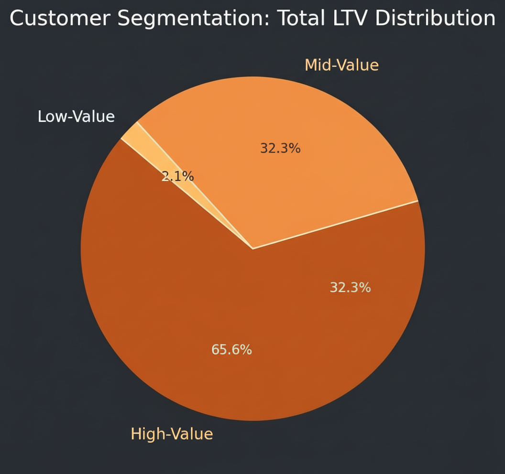
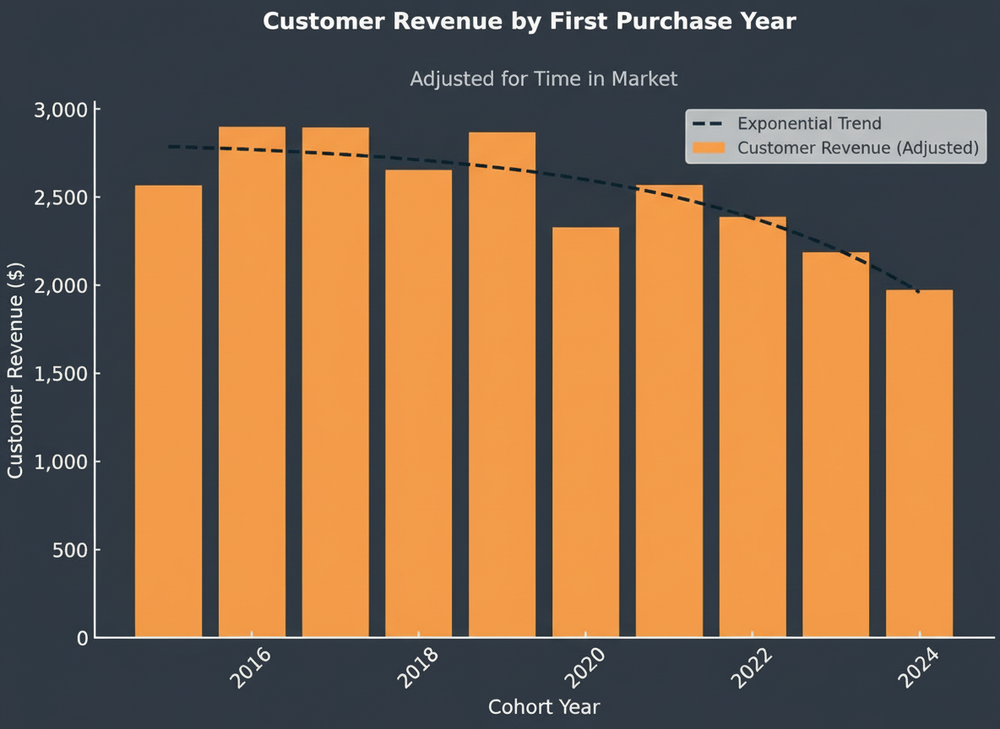
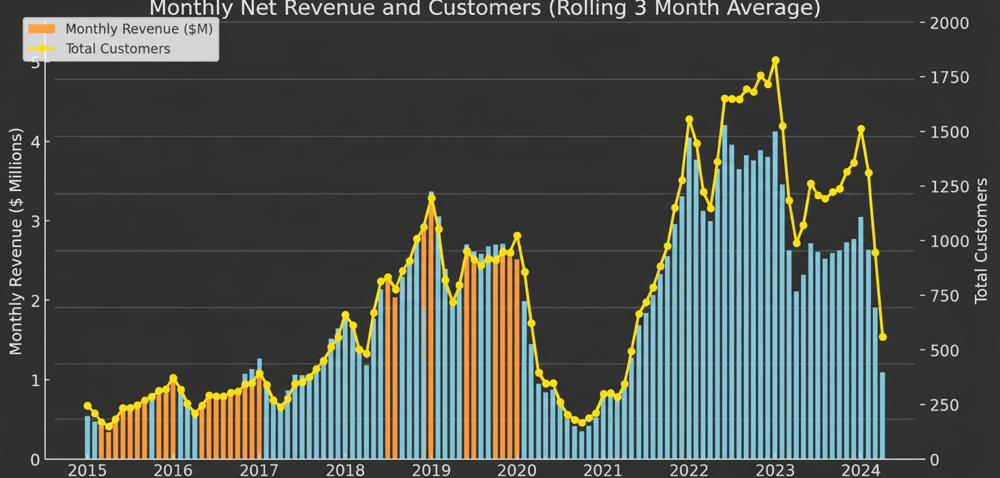
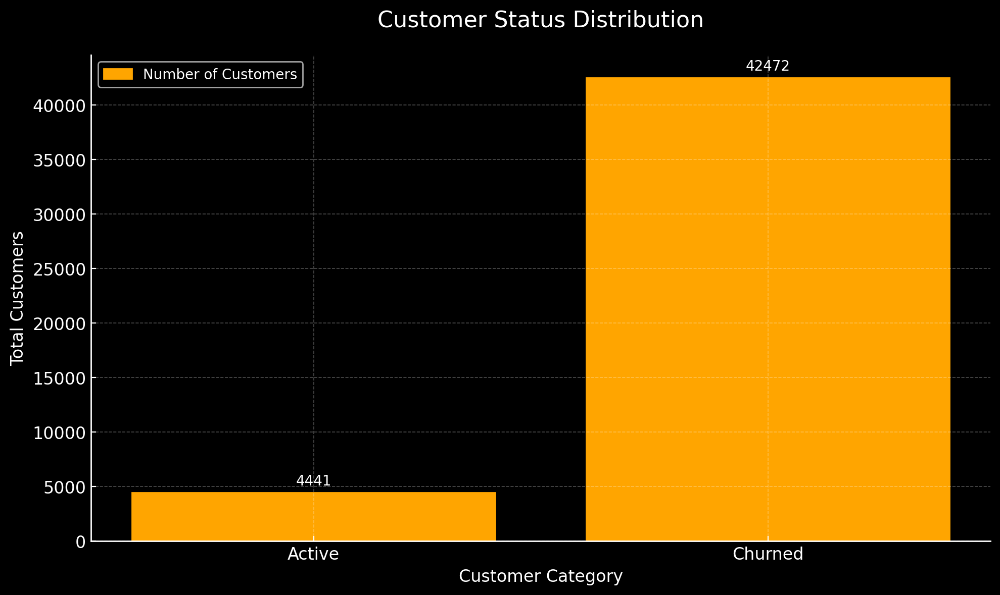

## 📊 Analysis & Business Intelligence

### 1. Value Segmentation (The Pareto Analysis)
**Script:** `1_Customer_Segmentation.sql`

I segmented the user base into High, Mid, and Low value tiers based on Lifetime Value (LTV) to identify where the revenue truly comes from.

**Visualization:**

**Key Findings:**
* **The "Whales":** The top 25% of customers drive a massive **66% of total revenue** ($135.4M).
* **The Middle Class:** 50% of users generate 32% of revenue.
* **Low Impact:** The bottom 25% contributes only 2%.

**💡 Strategic Move:**
Prioritize the top 12,372 VIP customers with a **Premium Membership Program**. Losing even a small fraction of this group would be catastrophic for the bottom line. For the Mid-Value segment, implement "Upgrade Paths" (upselling) to unlock a potential $68M in growth.

### 2. Cohort Performance (Vintage Analysis)
**Script:** `2_Cohort_Analysis.sql`

This module tracks revenue trends based on when customers joined the platform (Year of First Purchase).

**Visualizations:**

**Key Findings:**
* **Value Erosion:** Older cohorts (2016-2018) spent ~$2,800+ per user, while the 2024 cohort averages only ~$1,970.
* **Recent Decline:** After peaking in 2022-2023, both user acquisition and revenue are trending downward in 2024.
* **Volatility:** Significant drops in 2020 and 2024 indicate instability in customer retention or market fit.

**💡 Strategic Move:**
Investigate the onboarding process for the 2022-2024 cohorts. We need to apply the engagement strategies that worked for the "Golden Era" (2016-2018) users to the newer customers to arrest the decline in spending.

### 3. Retention & Churn Risk
**Script:** `3_Retention_Analysis.sql`

Here, I analyzed the "Leaky Bucket" problem—identifying when and why customers stop purchasing.

**Visualization:**

**Key Findings:**
* **Systemic Churn:** Retention consistently drops to ~8-10% across all cohorts.
* **The 3-Year Cliff:** Churn stabilizes at ~90% after 2-3 years regardless of when the customer joined.
* **Predictable Pattern:** Newer cohorts are following the exact same exit trajectory as older ones.

**💡 Strategic Move:**
Since long-term churn is predictable, the focus must shift to **Early Intervention**.
1.  **Years 1-2:** Implement aggressive loyalty rewards to keep users past the initial drop-off point.
2.  **Win-Back:** Don't spam everyone. Target *High-Value* lapsed users with personalized offers, as they yield the highest ROI on re-engagement efforts.

---

## 🚀 Final Recommendations

Based on the data, the business should pivot its strategy to:

1.  **Protect the Core:** Launch a VIP program immediately for the top 25% of users.
2.  **Stabilize Revenue:** Counteract the 2024 dip by introducing subscription models that smooth out revenue volatility.
3.  **Proactive Alerts:** Build a system to flag "at-risk" customers *before* they hit the 3-year churn wall, allowing for real-time intervention.

---

## 💻 Tech Stack
* **Language:** SQL (PostgreSQL)
* **Environment:** DBeaver
* **Visualization:** Generated via AI assistance based on SQL outputs
* **Part of the course:** (https://www.lukebarousse.com/products/intermediate-sql-for-data-analytics)
